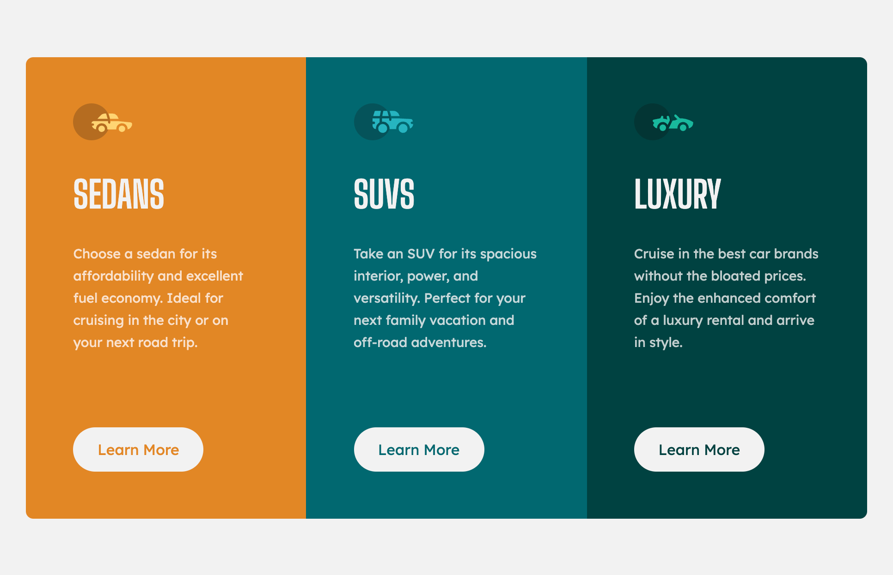

# Frontend Mentor
#### 3-column preview card component solution
---

 

## 🖥 Preview

Mobile Preview

 

## 📎 Links
- [Git Repository URL](https://github.com/kyungeun-j/frontend-mentor-challenges/tree/master/3-column-preview-card-component)
- [Live Site URL](https://kyungeun-j.github.io/frontend-mentor-challenges/3-column-preview-card-component/)